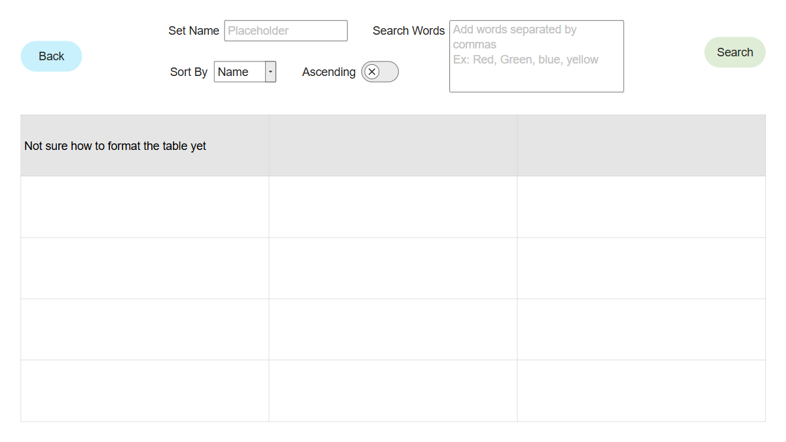

# Web Dev Starter Code

## Project Spec

For this project, I ended up browsing the Google Graveyard and found an
idea called Google Sets. The concept is that the website tells you to
enter a few words, and gives back a set of related words. I thought the
idea was interesting, so I'm going to try and create what I think the 
project was going for.

The main things the project would do is basically just take what words 
you enter and use the database to find a set of related words to give 
back. My plan right now is to have a page where users can submit a "set" 
of their own, where they connect different words together. Beyond that, 
I believe being able to view all the sets is a good way to let people 
see what sets are already there.

I think my audience is just the general public. I doubt there's any 
specific market for this.

For data, I haven't quite decided how I want to make it work. I think 
making a table with each of the sets is good, but from there, Im not sure 
how to handle words, especially if they're used several times, it could 
impact performance to search lots of entries for not just one, but 
possibly several strings. Storing each word as an ID in the database 
might take up far more space though.

I currently don't have any stretch goals in mind, but populating the 
database might be an interesting challenge if I decide to make a program 
that can scrape data from a dictionary or something related to make sets.

## Project Wireframe

## Sources Used
https://developer.mozilla.org/en-US/docs/Web/CSS/Guides/Cascading_variables/Using_custom_properties - for the CSS variables

https://developer.mozilla.org/en-US/docs/Web/API/Fetch_API - for using the Fetch API instead of XML requests